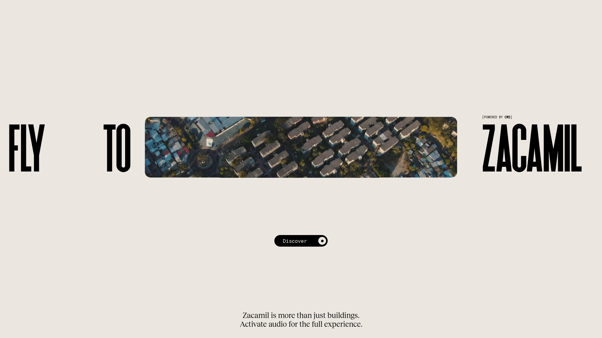
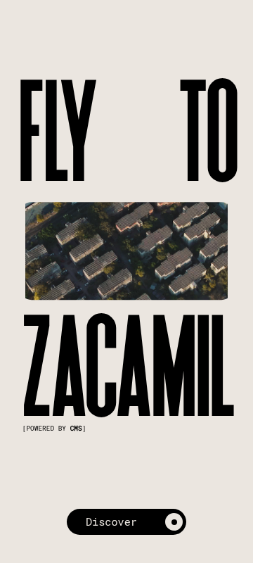

# Colonia Zacamil 設計分析

- **網址**：https://coloniazacamil.com/
- **研究日期**：2026-10-01
- **研究頁面**：首頁（入口畫面）
- **類型**：互動敘事／社區公共藝術專案（3D WebGL 體驗）
- **來源**：Awwwards Site of the Day（2026-10-01），作者 Adoratorio Studio、60fps
- **Awwwards 評分**：Design 7.56、Usability 7.42、Creativity 7.81、Content 7.69
- **技術**：WebGL、Three.js、Vue.js（依 Awwwards 標示）

> **研究範圍限制**：這次只抓得到入口畫面。按下「Discover」之後的 3D 地圖體驗需要實際操作瀏覽器，
> 但研究環境的網路政策擋住了 `coloniazacamil.com` 和 `assets.awwwards.com`，所以內頁的分析是根據
> 頁面文字和 Firecrawl 擷取的資料推測，並已標明「推測」。

## 一句話總結

用「FLY TO ZACAMIL」這句超大窄體標題夾住一段空拍影片，營造飛進社區的電影感開場。
接著進入可拖曳、縮放的 3D 社區地圖，用 26 個故事點串起公共藝術與居民的聲音。

## 1. 版面結構

入口畫面是單一全螢幕畫面，不能捲動，由上到下：

1. **大面積留白**：上方約 1/3 完全留空，視線集中在中央。
2. **標題列**（垂直置中）：`FLY` `TO` `[空拍影片]` `ZACAMIL` 橫排一行，文字和影片同高，影片就像句子裡的一個字。
3. **小標註**：`[POWERED BY CMS]` 用等寬字貼在 ZACAMIL 左上角，像註腳。
4. **CTA**：置中的膠囊按鈕「Discover」。
5. **底部說明**：兩行置中的襯線字：「Zacamil is more than just buildings. Activate audio for the full experience.」

- 內容寬度：標題幾乎貼齊左右邊緣（左邊距約 28px／1920），沒有傳統的內容寬度上限。
- 網格：不是欄網格，而是「一行文字＋影像」的水平構圖，元素之間的距離刻意拉開，製造節奏感。

**主要體驗（推測）**：按下 Discover 後進入 3D 社區地圖。頁面文字裡有 26 個地點／故事名稱
（From Thorns、Santa Zacamil、Fire Tree、Mayan Temples、Cadejo、Volcano、The Bus、Cancha、Park…），
加上操作提示「click and drag to explore」「scroll to zoom in & out」（手機版是 swipe／pinch），
可以判斷是在地圖上點選熱點、展開各個故事的探索式架構。

**可以學的地方**：把影片當成標題裡的一個「字」排進句子，標題本身就成了主視覺，不需要另外放 Hero 圖。

## 2. 配色

| 用途 | 色碼 | 使用位置 |
| --- | --- | --- |
| 背景 | `#EBE6E0` | 全頁底色，暖米白（截圖實測） |
| 文字／按鈕 | `#000000` | 標題、按鈕底色（截圖實測） |
| 按鈕文字 | `#EBE6E0` | 反白，與背景同色 |
| 主色 | `#AF0000` | 入口畫面看不到，推測用在 3D 地圖的熱點或標籤 |
| 輔助色 | `#B48E46` | 同上，土金色 |
| 強調色 | `#8D7CAB` | 同上，灰紫色；Firecrawl 判定為連結色 |

- Awwwards 登錄的色票：`#CDC3B7`、`#000000`
- 深色模式：無
- 漸層與陰影：完全不用，靠影片提供全部的色彩和質感

**可以學的地方**：介面只用米白和黑兩色，把顏色全部留給影像內容（空拍的屋頂、樹木），
內容就是色彩來源。米白而不是純白，讓畫面有紙張感，也呼應「社區手作」的溫度。

## 3. 字型

| 層級 | 字型 | 字級 | 字重 | 行高 |
| --- | --- | --- | --- | --- |
| 展示標題（FLY TO ZACAMIL） | 極窄無襯線、全大寫（字型名稱未取得，推測是 compressed grotesk 一類） | 約 160px（1920 寬） | 粗 | 1 |
| 說明文字 | 襯線體（Firecrawl 回報 Times New Roman，可能是讀取到的後備字型） | 約 24px | 400 | 約 1.2 |
| 按鈕、標註 | Roboto Mono（等寬） | 按鈕約 16px、標註約 11px | 400 | — |

三種字型各有分工：窄體大標做衝擊、襯線做敘述、等寬做介面標籤。

**可以學的地方**：極窄字體可以在一行裡放進很大的字級，同時留出位置給影像。
`[POWERED BY CMS]` 這種中括號加等寬字的寫法，讓小字看起來像「技術註記」，很適合用在 metadata 類的資訊。

## 4. 元件與視覺元素

- **按鈕**：黑底膠囊形，`border-radius: 30px`，約 170×37px，無陰影。左邊是文字，右邊是白色圓圈加黑點的圖示，看起來像「錄音／播放」鍵，暗示接下來有聲音。
- **影片框**：約 996×194px 的寬幅比例（約 5:1），四角小圓角，播放空拍社區的影片。
- **圖示**：只有按鈕上的圓點，極簡。
- **影像**：空拍影片當入口主視覺；主要體驗是 3D WebGL 場景（推測）。

**可以學的地方**：按鈕圖示不只是裝飾，也預告了體驗（聲音），和底部的「Activate audio」文案互相呼應。

## 5. 互動與動態

截圖看不到動態，以下根據頁面文字推測：

- 入口：「FLY TO」暗示按下 Discover 後鏡頭會飛進社區，從空拍影片轉場到 3D 場景（推測）。
- 主體驗：拖曳平移、滾輪或雙指縮放，桌機和手機各有不同的操作提示文字（頁面文字中有確認）。
- 聲音：明確鼓勵開啟音效。
- `viewport` 設定了 `user-scalable=no`，把縮放手勢留給 3D 場景使用。

**可以學的地方**：同一個操作分別寫桌機和手機版的提示文字（drag／swipe、scroll／pinch），是 3D 網站必要的細節。

## 6. 文案與資訊架構

- **主標語**：「FLY TO ZACAMIL」——用動詞開頭，直接邀請行動
- **副標**：「Zacamil is more than just buildings.」——一句話點出專案理念
- **語氣**：詩意、低調、敘事性強
- **CTA**：「Discover」
- **導覽列**：沒有。入口畫面完全沒有選單，只有一條路徑可以走
- **內容架構**：26 個故事點，英文和西班牙文混用（Paz y Pachamama、Adentro／Afuera、De Ónde Venimos），保留在地語言的味道

**可以學的地方**：入口拿掉導覽列，只留一個按鈕，適合體驗型網站。
但這對想直接找資訊的使用者是阻礙，Usability 是四項評分中最低的（7.42），可能和這有關（推測）。

## 7. 響應式設計

- 桌機版的單行標題在手機上拆成三行：`FLY TO` → 影片 → `ZACAMIL`，變成垂直堆疊。
- 影片從約 5:1 的寬幅改成約 2:1，寬度接近滿版。
- `ZACAMIL` 仍然幾乎撐滿螢幕寬度，保持衝擊力；`[POWERED BY CMS]` 從標題上方移到下方。
- 底部說明文字在手機首屏看不到（被推到畫面外，或手機版沒有顯示）。
- 操作提示有手機專屬版本（swipe／pinch）。

**可以學的地方**：同一組元素，只靠「橫排改直排」就完成響應式，不需要為手機另做設計，視覺語言也保持一致。

## 優點與可改進處

**優點**
- 開場構圖辨識度很高，文字和影像融為一體
- 介面極度克制（兩色、三種字型），把舞台讓給內容
- 文案、按鈕圖示、聲音提示整合成一致的「沉浸式」暗示
- 響應式的處理簡單又有效

**可改進處**
- 入口沒有任何專案說明或導覽，第一次來的人不知道這是什麼組織、要做什麼
- `user-scalable=no` 會影響需要放大文字的使用者（無障礙問題）
- 主要內容都在 WebGL 裡，搜尋引擎和螢幕閱讀器很難讀到（頁面 `description` 只寫了「Colonia Zacamil」）
- 載入 3D 場景的成本高，網路慢的使用者會等很久（推測）

## 參考價值評分

| 面向 | 分數（1–5） |
| --- | --- |
| 視覺美感 | 5 |
| 資訊清晰度 | 2 |
| 轉換導向 | 2 |
| 獨特性 | 5 |

最適合參考的情境：品牌故事、展覽、地方創生、作品集這類「體驗優先」的網站；不適合電商或 SaaS 這類需要快速找到資訊的網站。
